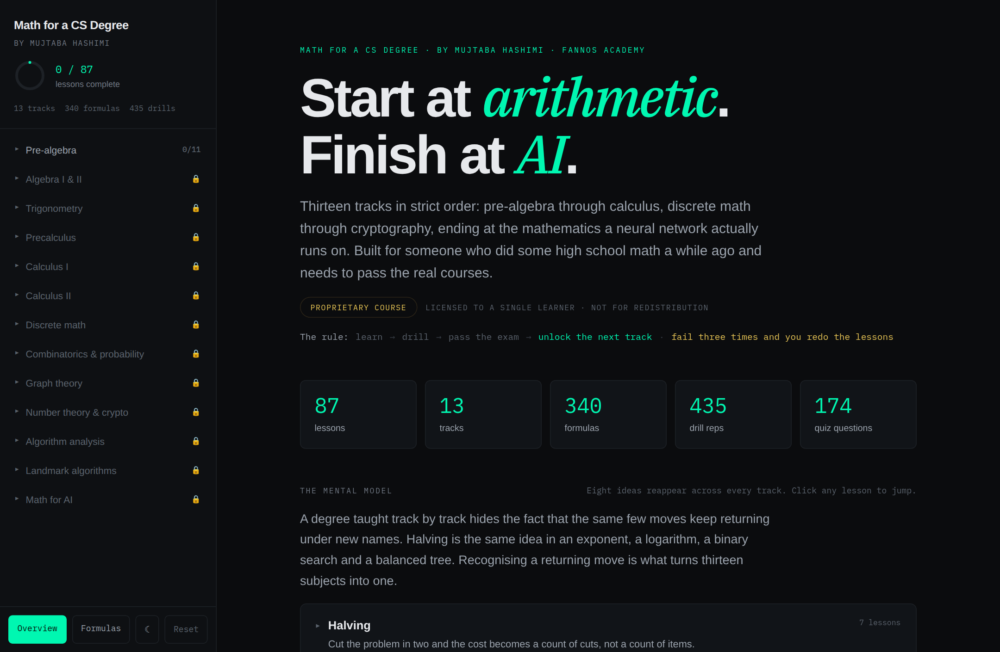
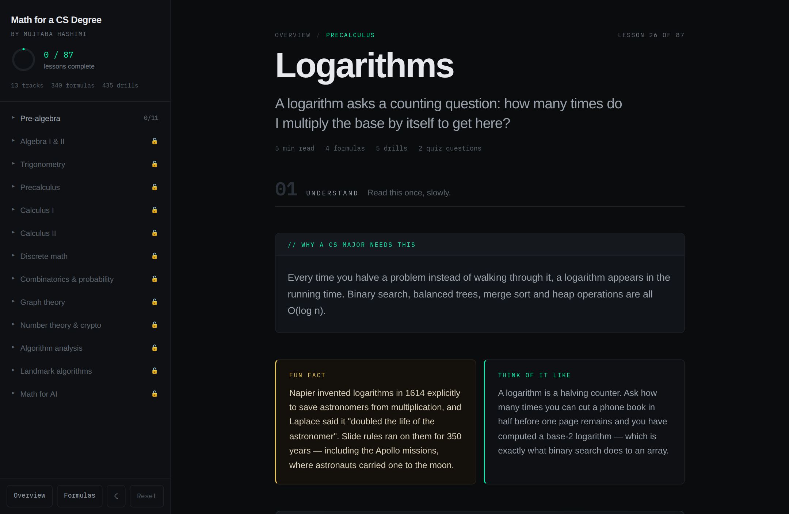
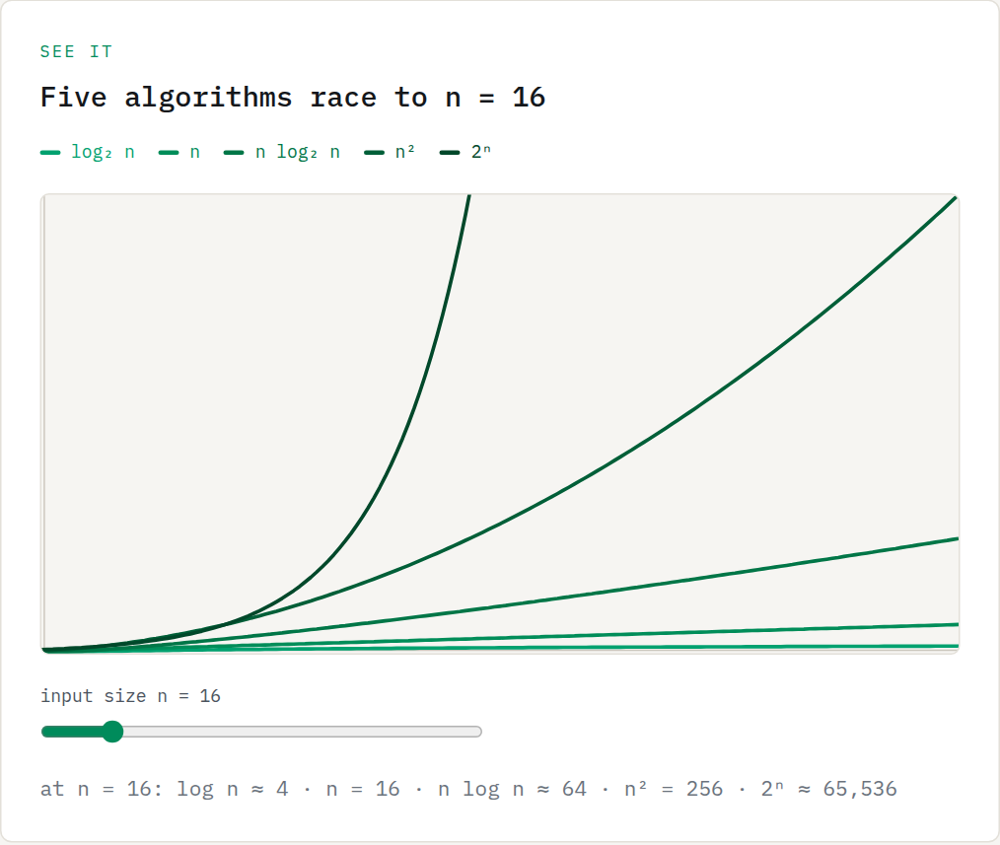
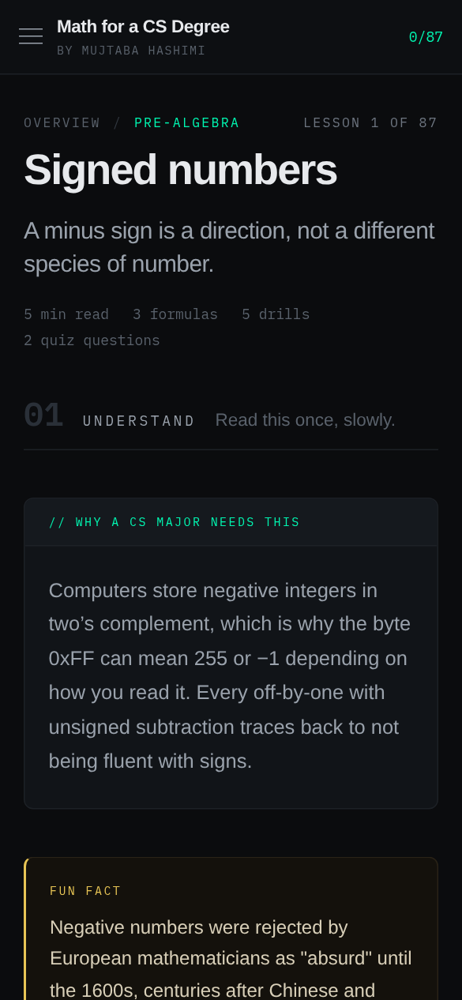
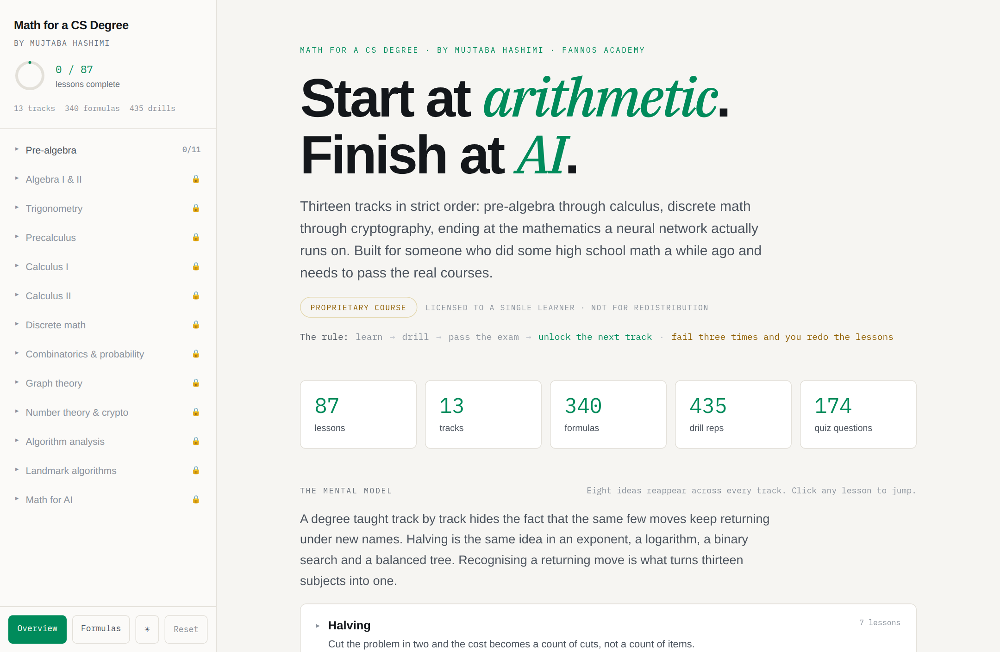

<h1 align="center">Math for a CS Degree</h1>

<p align="center">
  <em>Start at arithmetic. Finish at AI.</em>
</p>

<p align="center">
  <a href="https://github.com/mujtabahashimi/math-for-cs/actions/workflows/ci.yml"></a>
  
  
  <a href="./LICENSE"></a>
  
</p>

<p align="center">
  
</p>

A self-paced, thirteen-track mathematics course that runs from arithmetic to the
mathematics a neural network actually executes — built as a production Next.js
application from the Claude Design prototype in [`design/`](./design).

The rule of the course is the product: **learn → drill → pass the exam → unlock
the next track**, and fail an exam three times and the flagged lessons are
un-marked for you to redo. You cannot skip ahead to calculus on a shaky
pre-algebra foundation, which is the failure mode the whole thing exists to
prevent. These gates guide one learner in one browser; they are not an identity
or certification security boundary.

| | |
| --- | --- |
| **87** lessons | **13** tracks, in strict order |
| **340** formulas | on one printable sheet |
| **174** quiz questions | **87** of them feeding the exams |
| **435** drills | plus **69** generators, so reps can't be memorised |
| **15** interactive figures | **3** step-through demos |
| **110** pages | generated by the production build |

## What's inside

- **87 connected lessons across thirteen tracks**, each opening with a plain
  definition and its place in the concept map before the CS payoff, analogy,
  derivation and formula cards.
- **A complete concept atlas** that groups every lesson by the question it
  answers and traces recurring ideas — including Pythagoras becoming distance,
  trigonometric identity, vector length and cosine similarity.
- **Practice in three modes**: a match game and procedurally generated drills
  (69 generators produce fresh numbers every round, so nothing can be
  memorised), 174 quiz questions that test recognition, and an AI-marked
  written answer that tests production.
- **Fifteen interactive visualisations** with live sliders — gradient descent
  diverging past η = 1, the discriminant changing a parabola's roots, entropy
  peaking at exactly one bit for a fair coin — plus three step-through demos.
- **Browser-graded track exams** at a 70% pass mark, a comprehensive final at
  80%, a three-strike remediation rule, and a printable completion record.
- **A persistent review queue** that keeps every missed question until you come
  back and get it right.
- **An AI tutor** that re-teaches any lesson in the way you learn, and an AI
  examiner that marks written answers against a rubric.

<p align="center">
  
  <br><em>A lesson begins by naming the idea precisely and locating it in the wider mathematical map.</em>
</p>

<p align="center">
  
  <br><em>Multi-series figures step down one sequential ramp in magnitude order — ordered data, not a rainbow.</em>
</p>

<p align="center">
  
  &nbsp;&nbsp;
  
  <br><em>Mobile down to 360px, and a real light palette rather than an inverted filter.</em>
</p>

## Running it

```bash
npm install
npm run dev            # http://localhost:3000
```

The AI tutor and the written-answer marking call the Anthropic API from route
handlers, so the key stays server-side:

```bash
cp .env.example .env.local
# then set ANTHROPIC_API_KEY
```

Without a key the rest of the course works unchanged — the two AI panels report
that they are not configured rather than failing.

```bash
npm run build          # production build
npm run start          # serve the build
npm run lint           # eslint
npx tsc --noEmit       # typecheck
```

## Deploying

The app is a stock Next.js 16 project, so Vercel needs no configuration beyond
one environment variable.

1. Push this repository to GitHub.
2. In Vercel, **Add New → Project**, import the repository, and accept the
   detected Next.js settings.
3. Add `ANTHROPIC_API_KEY` (or `OPENAI_API_KEY`) under **Settings →
   Environment Variables** for Production, Preview and Development. Either
   provider works; set `AI_PROVIDER` only if both keys are present and you want
   to pin one.
4. Deploy.

Everything except the two AI panels is statically prerendered — 87 lesson pages,
14 exams, the overview, the formula sheet and the certificate — so the only
server work at request time is `/api/tutor` and `/api/grade`. The build
deliberately does not require a key, so a deploy that is missing one still
succeeds and the two panels report themselves unconfigured.

## How it is put together

| Path | What lives there |
| --- | --- |
| `src/app` | Routes: overview, `lesson/[lessonId]`, `exam/[trackId]`, `formulas`, `certificate`, and the two API handlers |
| `src/components` | The shell (sidebar, drawer, proctoring overlay) and the view components |
| `src/lib/course.ts` | Server-safe accessors over the course content — lesson lookup, exam pools, the formula sheet, course statistics |
| `src/lib/concept-graph.ts` | The canonical 87-node concept map — regions, typed relationships and cross-track learning paths |
| `src/lib/progress.tsx` | All learner state: completion, exam passes, strikes, the review queue, theme, proctoring |
| `src/lib/graphs.ts` | The fifteen visualisation definitions |
| `src/lib/types.ts` | Domain types and the pass marks |
| `src/data` | Course content as data modules (`.js` with hand-written `.d.ts`), kept verbatim from the design bundle |
| `design/` | The original Claude Design handoff — prototype, chat transcripts, content sources |

Content is data, not markup: adding a lesson means adding an entry to
`src/data/course-data.js` (plus its depth, fact and optional drill generator),
and every count on the home page, the formula sheet and the exam pools follows
from it.

### Progress and gating

Learner state is client-side and persisted to `localStorage` under
`mfcs-progress-v1`. Track unlocking is derived rather than stored: a track is
open only when every track before it has a passing exam. This keeps the local
experience internally consistent, but it is intentionally advisory: a learner
can alter browser storage or open a lesson URL directly. Server-side identity,
attempt storage and answer-key isolation are required before treating the
result as a verified credential.

### The design system

Two accents, and nothing decorative. **Mint** carries progress and anything the
learner acts on; **gold** carries assessment and licence; **red** is reserved for
a wrong answer and is never used as a fourth colour. Everything else is neutral
ink. No component names a hex value — they compose semantic tokens
(`bg-surface`, `text-ink-muted`, `border-line`, `text-accent`), so the palette is
changed in one file.

Dark is the designed default; light is a real palette rather than an inverted
filter. The choice persists and is resolved by an inline script before first
paint, so a stored light theme never flashes dark.

Element defaults live in `@layer base` deliberately: unlayered CSS outranks every
layered rule, so a bare `a { color: … }` would silently beat any text colour
utility on a link.

### Charts

The fifteen figures plot ordered quantities, so multi-series charts step down a
single-hue **sequential ramp** in magnitude order rather than taking a colour
each — the growth-rate race runs lightest for `log n` to darkest for `2ⁿ`. The
ramp is monotonic in lightness and holds 3:1 contrast against the chart surface
in both themes, and identity always comes from the legend and the readout line,
never from hue alone.

### A note on the proctoring

The exam view counts tab switches, blocks copying while an attempt is live, and
blurs the app behind a licence notice on a screenshot chord. A browser cannot
truly prevent capture or prove who took an exam. These behaviours are visible
deterrents for self-study, not proctoring or credential-integrity controls.

## Contributing

Contributions are welcome — corrections to the mathematics most of all, since a
wrong explanation teaches someone the wrong thing.

- [**CONTRIBUTING.md**](./CONTRIBUTING.md) — project layout, the four checks CI
  runs, how to add a lesson or a visualisation, and the colour rules.
- [**CODE_OF_CONDUCT.md**](./CODE_OF_CONDUCT.md) — this is a project about
  learning things people were told they were bad at, so the tone is part of the
  work.
- [**SECURITY.md**](./SECURITY.md) — how to report a vulnerability, and what is
  deliberately out of scope (the proctoring is a deterrent, not a control).

Before opening a pull request:

```bash
npm run audit && npm run typecheck && npm run lint && npm run build
```

## Licence

The **application** is licensed under the [Apache License 2.0](./LICENSE).

The **course content** under `src/data` and the design bundle under `design/`
are © 2026 Mujtaba Hashimi · Fannos Academy, and the app describes itself in its
own interface as a proprietary course licensed to a single learner. See
[NOTICE](./NOTICE). If you fork this to build your own course, replace
`src/data` with your own content.
